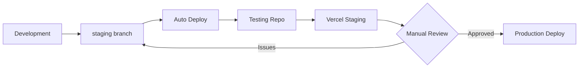

# 🧪 NAVADA OS - Testing Environment

This is the **staging testing repository** for NAVADA OS. All changes from the `staging` branch are automatically deployed here for testing before production release.

## 🔄 Deployment Pipeline

## 🚀 How It Works

1. **Push to `staging`** → Automatically triggers deployment
2. **GitHub Action** builds and tests the code
3. **Auto-deploy** to this testing repository
4. **Vercel** picks up changes and deploys to staging URL
5. **Manual review** → Production deployment when approved

## 🔗 Links

- **Staging URL**: https://navada-testing.vercel.app
- **Production URL**: https://navada.vercel.app
- **Main Repository**: https://github.com/leeakpareva/NAVADA_Device

## 📋 Testing Checklist

Before promoting to production, verify:

- [ ] ✅ All features work correctly
- [ ] ✅ Rate limiting functions properly
- [ ] ✅ AI Agent conversation works
- [ ] ✅ RAVEN Terminal generates/explains/debugs code
- [ ] ✅ Syntax highlighting displays correctly
- [ ] ✅ Mobile responsiveness maintained
- [ ] ✅ Performance is acceptable
- [ ] ✅ No console errors

## ⚡ Emergency Rollback

If issues are found in production:
1. Revert the staging branch
2. Wait for auto-deployment
3. Manually promote the fixed version

---

*This testing environment protects production from unstable releases.*